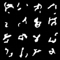

# -DDPM-Implementation-from-Scratch

## 概要

Ho et al. (2020)「Denoising Diffusion Probabilistic Models」をPyTorchでスクラッチしっぞう

## 動機

DDPMの順方向がランジュバン方程式と同型であることに着目。理論物理における確率過程の理解の一環として、数式から理解した内容を実装して検証する。

## 理論背景

順方向過程では決まったノイズによって時間発展させる:

$$
q(x_t \mid x_{t-1}) = \mathcal{N}(x_t;\,\sqrt{1-\beta_t}\,x_{t-1},\,\beta_t I)
$$

任意のステップ$t$に対して、訓練データ$x_0$から

$$
q(x_t | x_0) = N(x_t; \sqrt{ᾱ_t}x_0, (1-ᾱ_t)·I)
$$

と解析的に表せる。

## 実装の構成

本実装は Google Colab 上の1つのノートブック（`DDPM.ipynb`）で完結しています。

| セル | 内容 |
|------|------|
| セル1 | ライブラリのインポート・デバイス設定 |
| セル2 | MNISTデータセットの取得・DataLoader作成 |
| セル3 | DDPMクラス（順方向ノイズ付加・逆方向サンプリング） |
| セル4 | SinusoidalEmbedding・SimpleUNet モデル定義 |
| セル5 | 学習ループ（50エポック） |
| セル6 | 画像生成・可視化 |
| セル7 | 生成画像の保存（`sample.png`） |

## 結果

MINISTで50エポックで学習した結果のサンプル画像

